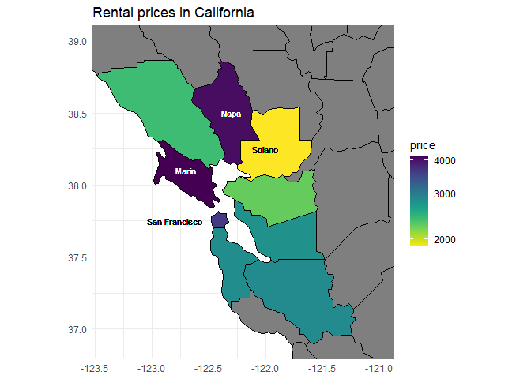
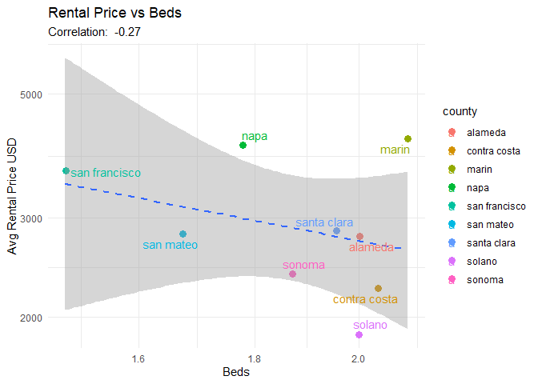
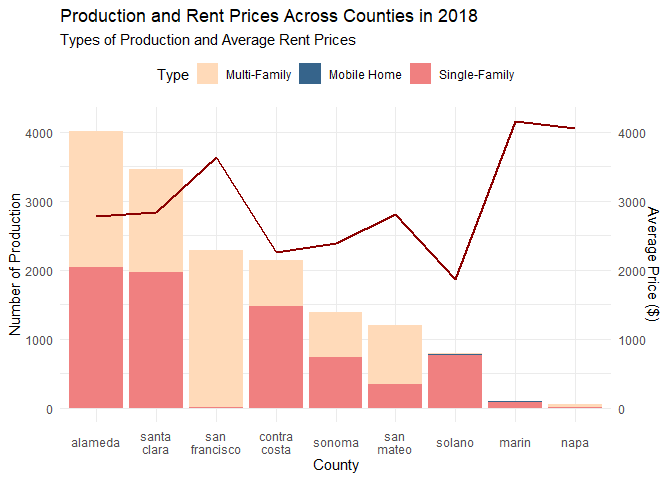

**Team Members:**
1.ETHAN YEO ALSAGOFF
2.GOH MING WEE
3.JIANG RUIRONG
4.RAEANNE CHOO CHENXI
5.TAN XUAN LE

# 1. Introduction
Over the last few years, the cost of living in first-world countries has been growing at an alarming rate. One of the biggest contributors to this rise in living costs is property. Due to the insane prices houses and lands now cost, renting property has become the preferential alternative to many. However, this increase in demand is insufficient in explaining the much steeper increase in rental prices.
Thus, our group chose the San Francisco Rentals dataset from TidyTuesday to provide a more in-depth understanding of why rental prices have been increasing as much as they have. Through the exploration of this dataset, we intend to find the factors that heavily impact rent prices in an area, then predict the current trend of the real estate market moving forward.

## 1.1 Question
> **What is the outlook of the rental market in San Francisco 2018?**

# 2. Data Description
**There are three datasets in total:** <br>

`rent` dataset is about the rent of houses across San Francisco. <br>
`sf_permits` dataset describes the details of permits being issued from 1985 to 2022. <br>
`new_construction` dataset about the production of houses in San Francisco. <br>

The `sf_permit` dataset only consists of data regarding building permits, which is more important to developers than consumers. Since our topic is about consumers rather than developers, we decided to not use this dataset.

## 2.1 Importing Data

```r
library(tidyverse)
```

```
## ── Attaching core tidyverse packages ──────────────────────── tidyverse 2.0.0 ──
## ✔ dplyr     1.1.3     ✔ readr     2.1.4
## ✔ forcats   1.0.0     ✔ stringr   1.5.0
## ✔ ggplot2   3.4.3     ✔ tibble    3.2.1
## ✔ lubridate 1.9.3     ✔ tidyr     1.3.0
## ✔ purrr     1.0.2     
## ── Conflicts ────────────────────────────────────────── tidyverse_conflicts() ──
## ✖ dplyr::filter() masks stats::filter()
## ✖ dplyr::lag()    masks stats::lag()
## ℹ Use the conflicted package (<http://conflicted.r-lib.org/>) to force all conflicts to become errors
```

```r
# install.packages("tidytuesdayR")
tuesdata <- tidytuesdayR::tt_load('2022-07-05')
```

```
## --- Compiling #TidyTuesday Information for 2022-07-05 ----
## --- There are 3 files available ---
## --- Starting Download ---
```

```
## 
## 	Downloading file 1 of 3: `rent.csv`
## 	Downloading file 2 of 3: `sf_permits.csv`
## 	Downloading file 3 of 3: `new_construction.csv`
```

```
## --- Download complete ---
```

```r
tuesdata <- tidytuesdayR::tt_load(2022, week = 27)
```

```
## --- Compiling #TidyTuesday Information for 2022-07-05 ----
## --- There are 3 files available ---
## --- Starting Download ---
```

```
## 
## 	Downloading file 1 of 3: `rent.csv`
## 	Downloading file 2 of 3: `sf_permits.csv`
## 	Downloading file 3 of 3: `new_construction.csv`
```

```
## --- Download complete ---
```

```r
rent <- tuesdata$rent
new_construction  <- tuesdata$new_construction
```

## 2.2 Data Cleaning
### 2.2.1 `rent.csv` Data Cleaning

To try avoiding short-term external rental shocks in the rental market, we decided to focus on data from 2018.
We then converted the date column into ymd format using the lubridate package and made the variable year as a factor for easier use during visualization.


```r
# Just some working to see percentage of data that is null
rent_null_count_df = data.frame(
  Column = names(rent),
  Null_Count = sapply(rent, function(x) sum(is.na(x))),
  Percentage_Null = sapply(rent, function(x) (sum(is.na(x)) / length(x)) * 100)
)
rent_null_count_df
```

```
##                  Column Null_Count Percentage_Null
## post_id         post_id          0       0.0000000
## date               date          0       0.0000000
## year               year          0       0.0000000
## nhood             nhood          0       0.0000000
## city               city          0       0.0000000
## county           county       1394       0.6942369
## price             price          0       0.0000000
## beds               beds       6608       3.2909022
## baths             baths     158121      78.7470866
## sqft               sqft     136117      67.7887010
## room_in_apt room_in_apt          0       0.0000000
## address         address     196888      98.0537461
## lat                 lat     193145      96.1896651
## lon                 lon     196484      97.8525469
## title             title       2517       1.2535110
## descr             descr     197542      98.3794498
## details         details     192780      96.0078886
```


```r
rent_clean = rent %>%
  select(-c("baths", "sqft", "address", "lat", "lon", "descr", "details")) %>%   # From the above table, delete columns that has more than 50% missing values
  na.omit() %>%
  distinct() %>%   # no duplicates
  filter(year >= 2013) %>%
  mutate(date = lubridate::ymd(date)) %>%     # converting the date into ymd format
  mutate(year = factor(year))
```

### 2.2.2 `new_construction.csv` Data Cleaning
First, let's calculate how many missing values there are across the different categories.

```r
# Create a dataframe to count null values and calculate percentages
new_construction_null_count_df <- data.frame(
  Column = names(new_construction),
  Null_Count = sapply(new_construction, function(x) sum(is.na(x))),
  Percentage_Null = sapply(new_construction, function(x) (sum(is.na(x)) / length(x)) * 100)
)

# Print the dataframe
print(new_construction_null_count_df)
```

```
##                                    Column Null_Count Percentage_Null
## cartodb_id                     cartodb_id          0               0
## the_geom                         the_geom        261             100
## the_geom_webmercator the_geom_webmercator        261             100
## county                             county          0               0
## year                                 year          0               0
## totalproduction           totalproduction          0               0
## sfproduction                 sfproduction          0               0
## mfproduction                 mfproduction          0               0
## mhproduction                 mhproduction          0               0
## source                             source          0               0
```
From the Data Frame above, we can see that values in `the_geom` and `the_geom_webmercator` columns are completely empty, and all other columns are fully filled.
We then take a look at the top few rows of the dataset, to see why those values are missing, and if it is safe to remove them.

```r
# top 6 rows of new_construction dataset
# head(new_construction)
# glimpse(new_construction)

# Get the different counties
# unique(new_construction$county)

# Range of year for new_construction Dataset
# unique_count <- new_construction %>%
#   select(year) %>%
#   unique() %>%
#   arrange(year)
# print(unique_count)

# Range of year for rent Dataset
# unique_count <- rent %>%
#   select(year) %>%
#   unique() %>%
#   arrange(year)
# print(unique_count)
```
A quick glimpse into the ‘new_construction’ dataset shows the_geom and the_geom_webmercator columns are completely empty, and within sfproduction, mfproduction and mhproduction there are some entries with negative values. We believe this to be accidental entries and modulate these negative values.


```r
new_construction_cleaned =  new_construction %>%
  select(-c("the_geom","the_geom_webmercator", "source")) %>% 
  mutate(sfproduction = abs(sfproduction),mfproduction = abs(mfproduction), mhproduction = abs(mhproduction)) %>% # some values in these 3 columns are negative
  mutate(totalproduction = (sfproduction + mfproduction + mhproduction)) %>%   # Recalculated totalproduction
  mutate(county = as.factor(county)) %>%
  mutate(county = str_replace(county, " County", "")) %>%   # To remove the word "County" in the county names
  mutate(county = tolower(county)) %>%   # Making it lowercase to match those in the rent data
  distinct()     # no duplicates though
# head(new_construction_cleaned, n =10)
```
### 2.2.3 Key Summary Statistics

```r
str(rent_clean)
```

```
## tibble [45,796 × 10] (S3: tbl_df/tbl/data.frame)
##  $ post_id    : chr [1:45796] "6379096957" "4168358289" "5536682206" "5536747083" ...
##  $ date       : Date[1:45796], format: "2017-11-08" "2013-11-03" ...
##  $ year       : Factor w/ 6 levels "2013","2014",..: 5 1 4 4 5 5 2 3 3 2 ...
##  $ nhood      : chr [1:45796] "alameda" "alameda" "alameda" "alameda" ...
##  $ city       : chr [1:45796] "alameda" "alameda" "alameda" "alameda" ...
##  $ county     : chr [1:45796] "alameda" "alameda" "alameda" "alameda" ...
##  $ price      : num [1:45796] 2925 2595 4895 1800 1795 ...
##  $ beds       : num [1:45796] 3 4 4 1 1 1 3 1 4 1 ...
##  $ room_in_apt: num [1:45796] 0 0 0 0 0 0 0 0 0 0 ...
##  $ title      : chr [1:45796] "CUT DOWN ON THOSE MOVE-IN COSTS WITH $500 OFF!!!" "Nov  2 Newly remodeled 4br/3ba (2 mastersuites) in quiet Fremont Neighborhood   $2595 / 1756ft² -    (alameda)   pic map" "Nis 12 4Br/3Ba, Alameda Executive home by Marina. ***PHOTOS***   $4895 / 4br - 2499ft2 -    (alameda)   resim har." "Nis 12 All New 1 Bedroom in Alameda   $1800 / 1br - 650ft2 -    (alameda)   har." ...
##  - attr(*, "na.action")= 'omit' Named int [1:10178] 9 93 112 338 360 383 392 394 409 420 ...
##   ..- attr(*, "names")= chr [1:10178] "9" "93" "112" "338" ...
```
We are now able to view rental prices for each house(price), which county its located in(county) and how many people can be housed in each rental(beds).


```r
str(new_construction_cleaned)
```

```
## tibble [261 × 7] (S3: tbl_df/tbl/data.frame)
##  $ cartodb_id     : num [1:261] 1 2 3 4 5 6 7 8 9 10 ...
##  $ county         : chr [1:261] "alameda" "alameda" "alameda" "alameda" ...
##  $ year           : num [1:261] 1990 1991 1992 1993 1994 ...
##  $ totalproduction: num [1:261] 3601 698 2652 3049 3083 ...
##  $ sfproduction   : num [1:261] 2166 236 2018 2693 2753 ...
##  $ mfproduction   : num [1:261] 1378 395 563 282 233 ...
##  $ mhproduction   : num [1:261] 57 67 71 74 97 69 72 69 73 78 ...
```
We are now able to see the total construction of housing(totalproduction) in each county(county), as well as whether the house being constructed is a single family home(sfproduction), multi-family home(mfproduction) or a mobile home(mhproduction).

# 3. Data Visualisation

## 3.1 Rent prices across San Francisco counties

```r
# install.packages("maps")
# install.packages("mapdata")
# install.packages("viridis")
library(maps)
```

```
## 
## Attaching package: 'maps'
```

```
## The following object is masked from 'package:purrr':
## 
##     map
```

```r
library(mapdata)
library(viridis) # This is for the colour scheme
```

```
## Loading required package: viridisLite
```

```
## 
## Attaching package: 'viridis'
```

```
## The following object is masked from 'package:maps':
## 
##     unemp
```

```r
# Preparing the data
# new_construction - Creating columns: percentage_sfproduction, percentage_mfproduction, percentage_mhproduction
new_construction_cleaned_df = new_construction_cleaned %>%
  filter(year == 2018) %>%
  mutate(percentage_sfproduction = (sfproduction/totalproduction)*100 ) %>%
  mutate(percentage_mfproduction = (mfproduction/totalproduction)*100 ) %>%
  mutate(percentage_mhproduction = (mhproduction/totalproduction)*100 ) %>%
  select(county, totalproduction, percentage_sfproduction:percentage_mhproduction)

# rent - select 2018, take average county rental prices
rent_clean_df = rent_clean %>%
  filter(year == "2018") %>%
  group_by(county) %>%
  summarize(price = mean(price), beds = mean(beds))

# join rent and new_construction together, include columns to calculate the correlation coefficient
df1 = rent_clean_df %>%
  left_join(new_construction_cleaned_df, by = "county") %>%
  na.omit() %>%  
  mutate(
    correlation_beds = cor(price, beds),
    correlation_totalproduction = cor(price, totalproduction),
    correlation_sfproduction = cor(price, percentage_sfproduction),
    correlation_mfproduction = cor(price, percentage_mfproduction),
    correlation_mhproduction = cor(price, percentage_mhproduction)
  )

# Get county Data - but the data here got more counties than our dataset
counties <- map_data("county")
ca_county <- counties %>%
  filter(region == "california")

df2 = ca_county%>%
  left_join(df1, by = c("subregion" = "county"))

# Create the baseplot for the Map of California
ca_base = ggplot(data = df2, mapping = aes(x = long, y = lat, group = group)) +
  coord_quickmap() +
  geom_polygon(color = "black", fill = "gray")+
  theme_void() +
  geom_polygon(data = ca_county, fill = NA, color = "white") +
  geom_polygon(color = "black", fill = NA)  # get the state border back on top

# Now, we plot the "heatmap"? of rental prices in San Fran counties
california_plot = ca_base +
  geom_polygon(data = df2, aes(fill = price), color = "white") +
  geom_polygon(color = "black", fill = NA) +
  labs( title = "Rental prices in California") +
  scale_fill_viridis(trans = "log10", direction = -1) +
  theme_minimal() +
  theme(axis.title = element_blank(),
        axis.ticks = element_blank()
        ) +
  geom_text(x=-122.3, y=38.5, label = "Napa", color = "white", size=3) +
  geom_text(x=-122.7, y=38.1, label="Marin", color="white", size=3) +
  geom_text(x=-122.0, y=38.25, label="Solano", color="black", size=3) +
  geom_text(x=-122.8, y=37.75, label="San Francisco", color="black", size=3)

# Zoom into the plot
california_plot + coord_quickmap(xlim = c(-123.4, -121),  ylim = c(36.9, 39.0))
```

```
## Coordinate system already present. Adding new coordinate system, which will
## replace the existing one.
```

<!-- -->
<br>
From the heatmap, we see a large range of average rental prices within the counties, with Solano having the cheapest average rental prices of around $2,000 USD, and Napa and Marin having average rental prices of around $4,000 USD. Using Compass’s estimation of the cost of living within each San Francisco county in 2018, the average rental prices are linearly related to the relative cost of living for each county. However, there is a notable exception with Marin county, having both the second lowest cost of living according to Compass, but the second highest average house rental prices. 

## 3.2 Number of Beds VS Rental Price Across Counties

```r
# install.packages(c("ggthemes", "ggrepel"))
library(ggthemes)
library(ggplot2)
library(ggrepel)

ggplot(df1, aes(x = beds, y = price)) +
  geom_point(aes(color=county), position = "jitter", size = 3) +
  geom_smooth(method = "lm", linetype = 2) +
  geom_text_repel(aes(label = county, color=county)) +
  labs(
    title = "Rental Price vs Beds",
    x = "Beds",
    y = "Avg Rental Price USD",
    subtitle = paste("Correlation: ", round(df1$correlation_beds, 2))
  ) +
  scale_x_log10() +
  scale_y_log10() +
  theme(legend.position = "None") +
  theme_minimal()
```

```
## `geom_smooth()` using formula = 'y ~ x'
```

<!-- -->
<br>
The second graph shows a decreasing trend of rental prices as the number of beds in a rental increases. The graph also shows the average numbers of beds in a rental in each county, as well as the average rental price. Although most counties follow this overall trend, we do see 2 outliers in Marin county and Napa county. Despite offering the average or above average number of beds in a rental house, both counties have the highest and second highest average rental prices respectively.

## 3.3 Production VS Rental Price Across Counties

```r
new_construction_cleaned2 = new_construction_cleaned %>%
  filter(year == 2018) %>%
  pivot_longer(sfproduction:mhproduction, names_to="type", values_to="numofproductions") %>%
  arrange(desc(totalproduction))

rent_cleaned2 = rent_clean %>%
  filter(year == 2018) %>%
  filter(county != "santa cruz") %>%   # removing "santa cruz" because the it is not available in construction dataset
  group_by(county) %>%
  summarise(avg_price = mean(price)) %>%
  ungroup()

joined_data = rent_cleaned2 %>%     # joining the rent and construction data
  left_join(new_construction_cleaned2, by = "county")

ggplot(joined_data, aes(x = reorder(county, -totalproduction))) +
  geom_col(aes(y = numofproductions, fill = type)) +     # plotting the stacked bar plot
  geom_line(aes(y = avg_price), group = 1, color = "darkred", size = 1) +     # plotting the line plot
  scale_y_continuous(name = "Number of Production", sec.axis = sec_axis(~., name = "Average Price ($)")) +
  labs(title = "Production and Rent Prices Across Counties in 2018", x = "County", subtitle = "Types of Production and Average Rent Prices") +
  theme_minimal() +
  theme(legend.position = "top") +
  scale_fill_manual(name = "Type", values = c("peachpuff", "steelblue4", "lightcoral"), labels = c("Multi-Family", "Mobile Home", "Single-Family")) +
  scale_color_manual(name = "Average Price", values = "darkred", labels = "Average Price") +
  theme(axis.text.x = element_text(vjust = 0.5, hjust = 0.5)) +
  scale_x_discrete(labels = function(x) str_wrap(x, width = 5))     # text wrap for the labels of x-axis
```

<!-- -->

Generally, the constructions of new houses in 2018 are multi-family and single-family houses. The county with the highest average rental price is Marin, where rental price goes beyond $4000. From the graph, we observe that both Marin and Napa have significantly fewer home productions compared to the other counties. Due to the low supply of rental houses, there could be a shortage in these counties, which drives rental prices up. In San Francisco, due to limited land availability, the productions there are mostly multi-family homes so as to house more people.

# 4. Discussion
Increases in the price of property rental is not simply about the size of an area. Although there is a general trend where the larger counties have lower average rental houses compared to the smaller counties, we do see Napa and Marin, 2 counties that are bigger than San Francisco county, having a higher average rental prices, shown in Figure 3. This suggests that we can make an expected rental price in a given area, but certain conditions must be met to hold true.
From Figure 4, it might be reasonable to assume it's more about what land is available to be used to build houses that affects rental prices. Considering Napa and Marin county’s high average rental prices, it would seem to be prime estate for developers to build houses and sell or rent them out. However, we see remarkably low constructions happening in 2018, suggesting there might not be any more land for new construction. This leads to a stagnation of available housing, leading to increased competition to secure housing, ending with an increase in prices.
From Figure 5, assuming there is sufficient land for new construction projects, if the average rental price is below expected values based on land size, single family homes will be favoured for construction. If the average rental price is around the expected value, both single family and multi-family homes will be constructed. If the average rental price is above the expected value, multi-family homes will be favoured for construction.

# 5. References:
1. A Look Back: San Francisco Real Estate Through Crisis <br> https://daniellelazier.com/look-back-san-francisco-real-estate-crisis/#:~:text=Due%20in%20large%20part%20to,11%25%20between%201990%20and%201995. <br>
2. Compass California, California Real Estate Blog <br> https://compasscaliforniablog.com/how-much-do-you-need-to-earn-to-live-in-each-bay-area-county/


